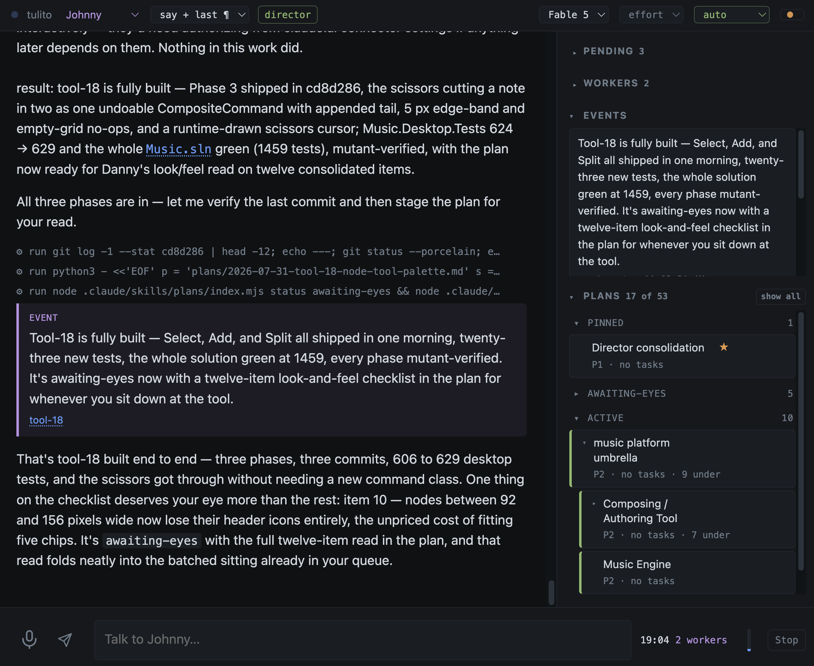
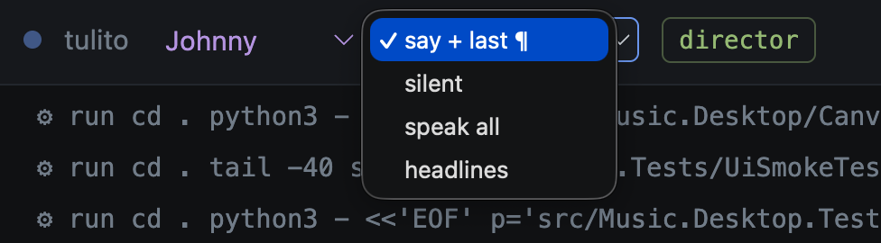
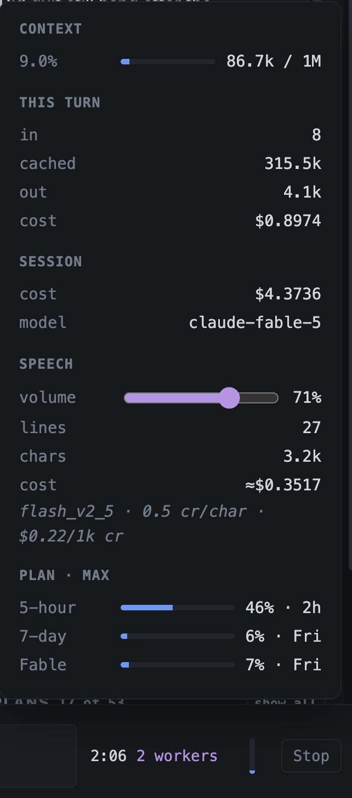
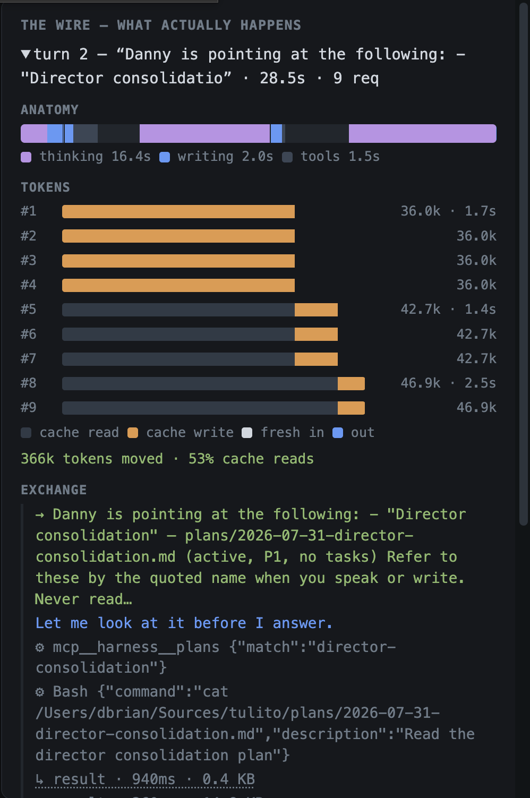
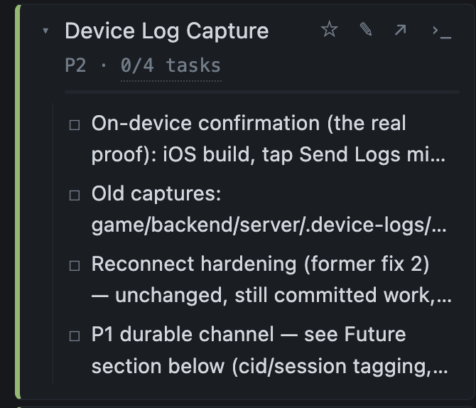
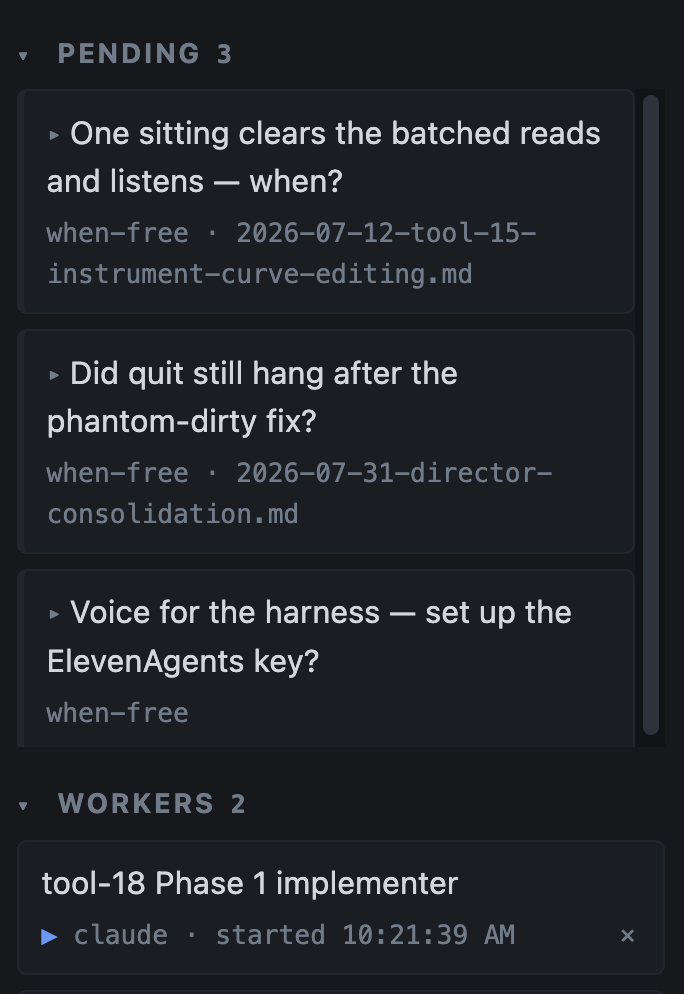
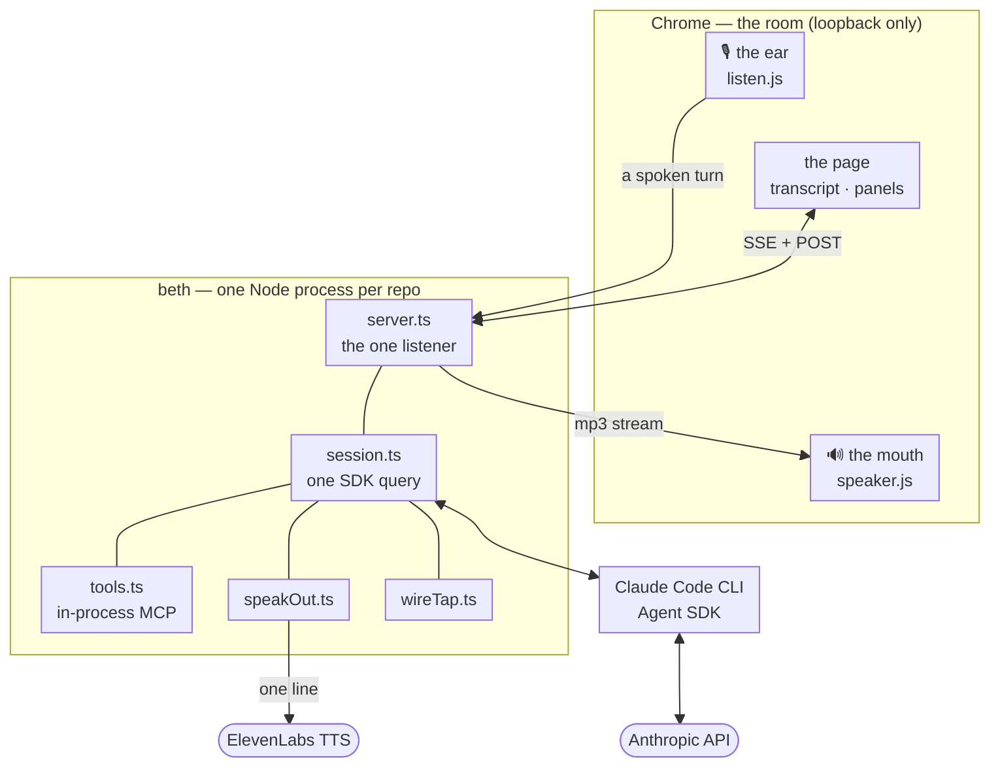
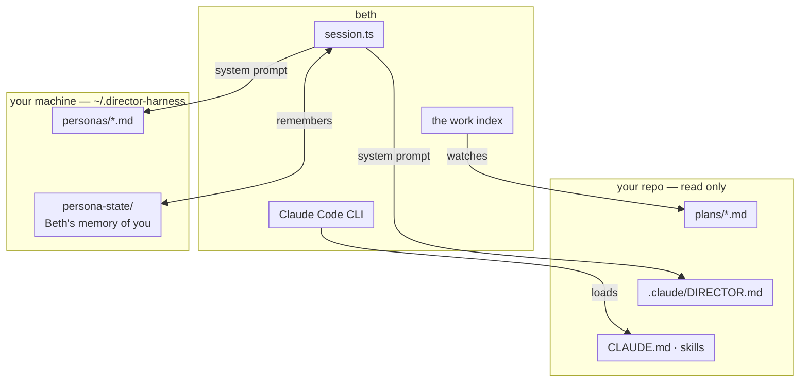

# Beth, a director agent harness

Yes another harness. But the one that fits *my* brain and workflows, talks to me about things I want to know, and keeps me on task. (And does so with zero dependencies other than the SDKs.) On a mature (or simply large enough) software project, especially as a solo developer, trying to actively manage more than 5-6 agents (I've had well over 20 going on a single project), *trying to spend a week's worth of tokens over the weekend*, manage worktrees and streams and dependencies... well, then it might be time for a director.

## Too Well Paid to Code
 
Beth is **not** much of a builder. Like you (and me), she (too) uses agents to help her write code; she is a **director** in the [builder pattern](https://refactoring.guru/design-patterns/builder). *And totally and completely unnecessary to that pattern, I might add!* She needs frontier models and might work off hours; *Beth will not save you money, only time*.

Beth is not needed. 🤷‍♂️ No project depends on her. 🤷‍♂️ In fact, neither I nor the agents like her very much. 🤷‍♂️🤷 (I will readily admit my tendency to anthropomorphize; the incongruity of "don't like her" was a joke she found funny. And frankly saying "it" doesn't quite work here, either. I work with .. it, quite a bit. Anyway, I will try to refrain from the pronouns.)

But she knows how to sequence, how to manage agents effectively, how to manage both our expectations, how to manage **me**, and is **able to carry a higher, additional level of context and reasoning on behalf of those she manages, so they don't need to**. She will work in to the evening hours. It's a question of scale, the need for additional agentic judgement in the loop to do so, *and a scale I don't think many projects achieve, or require*. In other words, don't use this instead of CC just because it talks. Or do. I don't care. Neither does it, I'm told by people who I trust.

## What This Is Not

- **Not an orchestrator.** Conductor, Vibe Kanban, Claude Code's own Squad and Agent Teams manage *many parallel sessions* — worktrees, dashboards, merge queues. Beth is the opposite bet: one standing director with judgment, who happens to dispatch workers. *If your bottleneck is parallelism plumbing, use those; mine was **attention**.*
- **Not an issue tracker.** [Beads](https://github.com/gastownhall/beads) exists precisely because piles of markdown plans go stale, and [Backlog.md](https://github.com/MrLesk/Backlog.md) does markdown-as-source-of-truth properly (and I might use one eventually). This harness takes no side: it defines the *shape* of a work item (`workItems.ts`) and reads it through a small contract — `/plans` is the built-in reader because dated markdown is *my* convention across *my* repos. A repo that lives in Linear, beads, or GitHub issues would supply its own reader; the panel doesn't care.
- **Not voice mode.** Claude Code's `/voice` is dictation in. This is conversation — she talks back, in a voice that's hers, excerpted because ninety seconds of unskippable audio is not six paragraphs of skimmable text. And because the harness uses an in-process MCP, saying out loud "I'm on a call, shhh" will deactivate or activate such settings at the client.

Everything here is opinionated, and the opinions are mine. Where I expect yours to differ, the seam is marked. This is what evolved for me in my own workflows.

## Benefits No One Without a Platform

A director agent's time/tokens and the tokens its subagents spend are wasted on errors, bugs, or other problems encountered during execution. This is not just a question of proper context or prompting; it's the likelihood of agents having success without their own retries or ratholes. This comes at an up-front cost of quality (of all kinds; think beyond tests towards telemetry etc.) for the repos in which a director agent can work. Of all the hurdles to my using AI more effectively for development, this is the one that most necessitated my need for a director agent: As the quality of a project increased, so did execution velocity. I was always the bottleneck. But once a platform is in place — something underneath to have already made the important decisions and answered the important questions — and knowing it was being done *how* I wanted, fully validated as such, I could step back a little. 

*What this harness does not do:* Ensure code quality, care about best practices, or, well, write good code, per se. Beth couldn't really care less how anything happens under the hood. Implementation, TDD, debugging, coding guidelines are not things provided here; those exist in your repo. Beth can help you build that all out, but won't do it for you.

*What this harness does:* Beth gives you a standing director on a single repo: someone who has already read the board, knows what shipped yesterday, holds the shape of the work while you hold a coffee, and can be talked to out loud while you pace. Basically, it fills in a lot of coordination, SDLC gaps. Claude Code and other tools give you a coding session (and I use it actively in parallel); what they don't give you is the *assistant* across from you — a name, a voice, a memory of me, an opinion about what I should do next, and a place to see the work together, while we argue about it. Beth cares about plans and managing their execution, and little else.

## How I Use It




Beth integrates with ElevenLabs for voice, and you can set the chattiness. Multiple personas can be defined, each with its own voice from your ElevenLabs account.




Beth tracks token use.





It also provides an under-the-hood visualization of token consumption, cache reads/writes, and thinking, which I find useful mainly for demonstration and education.





The harness can also run the repo's tests automatically, so status is a glance away and failures are easy for Beth to dig into. It doesn't act on results by itself — no automatic troubleshooting, by design.


## Director Agent

Beth puts an emphasis on proper planning, implementation oversight, and autonomous execution -- *and expects a properly documented, and well-tested workflow under that to make it happen*. The harness edits, maintains, updates, indexes, and displays ... well, plans.





Coordinator/director agents like this work best when taught the "lanes" of a project -- where it's probably better to run one subagent at a time, what can and can't be done in parallel, where worktrees are in flight and why, and how to prioritize and queue all of that. And this is largely because they can see all the plans and exercise judgement about them (just as with a DevOps agent platform), but it's also because a director will understand the broader goals or requirements -- for this reason Beth provides a plan hierarchy, for umbrella plans, subplans, and so on.

Markdown (indexed) plan files are *the* first-class citizen, and get displayed prominently as the source of truth for both Beth and you. Everything is a plan, subplan, tasks, and so on. Call them specs if you like; you can write and organize these however, and create your own plans skill that works best for your repo.

Beth can then surface pending questions or call for your attention, maintaining a queue across many plans and subagents.





One consequence of queuing up issues for you is that Beth's interactions with subagents are more frequent and often narrowly-scoped: *the director pattern incurs token cost, and benefits most from the best reasoning models.* It costs to scale -- and it won't work at all if subagents *can't* have their work narrowly scoped with good repo organization, modularity, testing, and documentation. Exploration is expensive, and the director pattern does little to change that.

## Underlying Skills

This repo includes the `/plans` and `/tidyrepo` skills I use. The `/plans` skill is what understands the plan file formats and indexing, and Beth's UI is built on that (and tidyrepo is used by the director periodically). However, the director still presumes *a lot* of discipline in a project's own documentation, skills, and so on. For example, clearly defined TDD/validation contracts throughout the documentation and skills that subagents will use. A director workflow *only* works after demonstrated success with these highly project-specific guardrails. In other words, you're unlikely to use Beth to bootstrap a new project (or at least, I haven't yet), and if you do, the conversation would start with planning to *build* those contracts, guidelines, clear testing strategies, and docs/skills to maintain them. See below for details on bootstrapping a new project using `/director-skills`.

(For me, markdown hits the *mark* for this kind of work. If your source of
truth is JIRA, GitHub issues, or something else with an API, the seam is
`workItems.ts`: the harness defines the shape of a work item, `/plans` is just
the built-in reader, and a reader of your own feeds the same panel. See *What
This Is Not*, above.)


```bash
cd ~/Sources/your-project && beth
```

That binds to the git root you are standing in, picks a free port (several
repos run side by side), opens the browser, and tears everything down on
Ctrl-C. `beth --help` for flags.

The design is one contract with three suppliers, and almost everything about
the harness falls out of it:

- **The harness supplies the ROLE** — an expert project manager who converses
  instead of reporting, narrates before anything slow, and protects your
  attention. It is project-agnostic on purpose and ships with opinions about
  *how* to direct, none about *what*.
- **Your repo supplies the PERSON and the WORK** — who the director is
  (`.claude/DIRECTOR.md`) and what is in flight (`plans/`). The harness only
  ever *reads* your repo — the director *session* it hosts writes code and
  commits through permission gates, like any Claude Code session (see Anatomy).
- **Your machine supplies the IDENTITIES** — credentials, and optionally
  *personas*: directors of your own that exist across every repo, with their
  own voices and their own memory of you (`~/.director-harness/personas/`).

## Anatomy

Everything Beth says and hears crosses one loopback listener:



This harness only ever *reads* your repo (subagents will read and write):



Every arrow touching your repo is a *read*; the one thing that ever writes
to a plan file is a rename you click. That is a claim about the harness
*plumbing*, not the whole system, obviously: the Claude session it hosts dispatches
workers that write code and commit, exactly as any Claude Code session would —
through the same permission gates. The safety story is the gate, not
read-onlyness. The browser and the harness
speak over one loopback listener — voice included — which is why the
shell-executing parts are safe by construction rather than by rule.

## Getting a repo ready: /director-skills

The fastest way to see it working is a repo that supplies its half
of the contract — and rather than document the formats in prose (which would
drift from the parser the moment either changed), the repo half ships as a
skill that sets it up with you:

```bash
ln -sf ~/Sources/beth/skills/director-skills ~/.claude/skills/director-skills
```

Then, in any repo, ask its director (or any Claude Code session) to run
`/director-skills`. It diagnoses before it writes: a repo with plans the
harness cannot read gets told *why* (often the fix is one env line); a
greenfield repo gets the format bootstrapped from managed templates — the
plans directory, the frontmatter schema, a vendored copy of the `/plans`
session tracker with its tests, `/tidyrepo` — and a director interviewed into
existence, because a person is the one thing a template cannot supply. The
harness will also offer this itself, once, when it boots against a repo with
nothing to read — with evidence, not as a wizard.

The reasoning is in `docs/director-skills.md`. This repo's own
`.claude/DIRECTOR.md` is the worked example of the interview's output.

## Talking To Beth Be Like

Heading was her idea. Text here works like any chat, with three differences:

- **The panel is shared ground.** Clicking a plan (or a failing test) *points at it* — Beth gets the
  reference, you get a chip, and "what's left on this?" needs no name. Rows
  carry a pin, a rename, a GitHub link, and one-click handoff to a fresh
  Claude Code terminal session seeded with the plan.
- **Decisions queue instead of interrupting.** Anything Beth wants decided but
  isn't blocked on lands in a queue with candidate answers as buttons. Both of
  you can close items; a queue with settled things in it stops being read.
- **Beth narrates.** Before anything longer than a breath — "hold on, running
  the suites" — and after it lands. Silence reading as failure is a voice
  lesson, but it improved the text too.
- **I'm still learning how best to use it.** I have to speak differently to Beth; it's easy to go down a rathole, or ask Beth to do something I should probably be doing with Claude Code (e.g. an implementation I haven't thought through or prepared for) or myself. Then something comes up in another workstream and my director is blocked on a rathole with me, and time is lost. So, Beth works best when plans (and if complex, implementation plans too) are written elsewhere, since those tend to require her focus.

**Voice is local end to end.** The browser recognizes what you say
(`ui/listen.js`) and posts an ordinary turn; Beth's replies stream back over
loopback as audio (`src/speakOut.ts`). Nothing dials in, nothing tunnels,
nothing is billed while idle, one listener bound to 127.0.0.1. Chrome only —
the Web Speech API is not in Safari or Firefox. Speech is an *excerpt* (the
page skims in seconds what audio cannot skip), the mic ducks reasoning effort
for latency, a settle window keeps half-sentences from becoming turns, and an
autosend toggle turns conversation into dictation when you want to edit before
sending. `docs/voice-plane.md` has the full story, including everything this
replaced.

Beth speaks in whatever voice the persona names (`voice:`), falling back to
`HARNESS_VOICE_ID`; the picker in the strip auditions the account's voices
live without writing anything down. Needs an `ELEVENLABS_API_KEY` with the
**Text to Speech** permission — without it the harness runs text-only and the
mic button explains what is missing.

## Personas

`~/.director-harness/personas/*.md` — one markdown file per director, none
shipped. Frontmatter names the director and the voice. A repo's
`DIRECTOR.md` still composes on top: the persona says who the director is, the
repo says what this project needs, and the repo wins where they overlap. Beth's
memory of you follows the *persona* (switching repos doesn't reset the
relationship); greeting habits stay per-project. Switching personas is a new conversation
— the page warns you — because a system prompt is fixed at session birth, and
you don't swap who you're talking to mid-thought.

An existing `DIRECTOR.md` copied into that directory *is* a valid persona —
the name is read from the same "You are **X**" sentence.

## What Beth remembers, and when it asks

`personal.jsonl`, append-only, never in your repo. The rule that keeps it from
being a rapport script: Beth may only ask about something it actually recorded
— a question comes from a fact with a date on it, at most once a day, and only at
a natural moment — the boot greeting, or the first turn after a long gap.
Most days that is silence, which is correct. `HARNESS_PERSONAL=off` means off:
nothing recorded, nothing asked.

The greeting itself is model-written, one sentence, made different each day by
the two things a fresh session can't otherwise have: what it opened with
recently ("not these"), and the facts that changed — branch, dirt, last
commit, what's in flight, the clock, the gap since the harness was last up.

(And yeah, I considered using a common memory library or data "lake" here, but I like that there are no dependencies beyond the two vendor SDKs. And again, nobody *needs* Beth.)

## The rest of the surface

- **Tests**: the top-right light detects the project's test command (never
  invents one), runs it when the tree settles and the session is idle, and is **off
  until you enable it per repo** — this executes project code on a schedule.
  Clicking a failure drops a chip, not a stack trace.
- **Permission cards**: tool calls the session can't settle on its own become cards; a
  card cannot be answered by voice, so the session defaults to the SDK's
  `auto` mode and "Always" scopes its rule to the session — never written to
  your repo's settings from a button.
- **Director-role handoff**: if a terminal session already holds the director
  plan, the harness comes up as a *shadow* — read everything, claim nothing.
  Promotion re-checks at the moment you click it.
- **The strip**: model, reasoning effort, permission mode, speech level, voice
  audition, persona — all live, all showing what the *server* believes rather
  than what was clicked.

## Running it

Prerequisites: **Node ≥ 23** (the harness runs TypeScript natively — no build
step), and **[Claude Code](https://claude.com/claude-code) installed and logged
in** — the Agent SDK drives the `claude` binary, and Beth rides its
authentication, so if `claude` works in your terminal, Beth has what it needs.
Chrome, if you want voice.

```bash
git clone git@github.com:dannybrian/beth.git ~/Sources/beth
cd ~/Sources/beth && pnpm install                      # or npm install
ln -sf ~/Sources/beth/bin/beth.mjs ~/.local/bin/beth   # once
cd <a-project-repo> && beth
```

Or directly, without port-picking: `node src/main.ts` → http://localhost:4620.

The three dependencies `pnpm install` pulls are each deliberate: the
[Claude Agent SDK](https://www.npmjs.com/package/@anthropic-ai/claude-agent-sdk),
zod, and the ElevenLabs SDK (TTS only, and only used if you configure voice).
The UI is dependency-free vanilla DOM over SSE + POST.

Config layers, most specific first: real env vars → the bound repo's `.env` →
`~/.director-harness/.env` (credentials belong in the machine file). Per-repo
state lives in `~/.director-harness/<repo-slug>/`; persona state in
`~/.director-harness/persona-state/<slug>/`. Nothing in this repo holds a key.

| Env | Default | Meaning |
|---|---|---|
| `HARNESS_PORT` | `4620` | Run a second instance alongside |
| `HARNESS_MODEL` | `claude-opus-5` | Director session model — the dominant cost lever |
| `HARNESS_CLAUDE_BIN` | `~/.local/bin/claude` | Native CLI (see gotcha below) |
| `HARNESS_DIRECTOR_PLAN` | — | The role-lock plan (`/director-skills` creates one) |
| `HARNESS_PLAN_ROOTS` | `plans` | Where plans live, when not `plans/` |
| `HARNESS_NO_KICKOFF` | — | Boot silently (cheap for testing) |
| `ELEVENLABS_API_KEY` | — | Voice. Needs the **Text to Speech** permission |
| `HARNESS_VOICE_ID` | — | The machine's default voice; personas override |
| `HARNESS_TTS_MODEL` | `eleven_flash_v2_5` | ⚠ Flash predates v3 audio tags — tags stripped |
| `HARNESS_SPEECH_LEVEL` | `brief` | How much is read aloud |
| `HARNESS_TTS_USD_PER_1K_CREDITS` | `0.22` | Your plan's credit price, for the estimate |
| `HARNESS_VOICE_SETTLE_MS` | `2500` | How long words must stop changing before a spoken turn sends |
| `HARNESS_VOICE_EFFORT` | `low` | Effort while the mic is open (`off` disables the duck) |
| `HARNESS_SPEECH_BIASING` | `off` | Bias the recogniser toward this project's nouns |
| `HARNESS_KEYTERMS` | — | Nouns no file mentions. ⚠ Accumulates across layers |
| `HARNESS_KEYTERM_BOOST` | `2` | How hard to push, 0–10 |
| `HARNESS_TEST_CMD` | detected | Test command override |
| `HARNESS_PERSONAL` | on | `off` disables remembering the person entirely |

## What's here

| Module | Owns |
|---|---|
| `session.ts` | The one long-lived streaming `query()`; turns; model/effort/permission/persona switches |
| `askgate.ts` | `canUseTool` — questions pend, everything else becomes an approve/deny card |
| `tools.ts` | In-process MCP: `say`, `queue_decision`, `close_decision`, `close_worker`, `pending`, `plans`, `speech`, `remember`, `recall` |
| `toolInput.ts` | Repairs a tool call written in two formats at once |
| `personas.ts` | Machine-level directors: reader, per-repo choice, memory seeding |
| `speakOut.ts` / `spoken.ts` / `audioTags.ts` | The speech plane: what is said, held, streamed, billed |
| `ui/listen.js` / `ui/speaker.js` / `ui/wire.js` | The ear, the mouth, and the wire panel — native ES modules, each tested from node with a stubbed browser object |
| `workIndex.ts` / `workItems.ts` / `plansReader.ts` | The work contract and its built-in reader |
| `planName.ts` | ⚠ The one plan-file writer — `name:` on rename, nothing else |
| `pins.ts` / `repoWeb.ts` / `handoff.ts` | Shelf, GitHub links resolved at click, terminal handoff |
| `personal.ts` / `greeting.ts` | Memory of the person; the boot line and the onboarding offer |
| `testRunner.ts` | Detect, settle, run, parse failures |
| `directorRole.ts` / `directorName.ts` | Shadow vs director; what to call the director |
| `server.ts` / `bus.ts` / `eventlog.ts` / `state.ts` | Transport, replay, events, queues |
| `keyterms.ts` / `links.ts` / `markdown.ts` / `activity.ts` | Vocabulary, file links as offsets, span overlays, activity lines |

`docs/` holds design records — the reasoning behind the voice plane, the status
surface, personal context, the plans panel, and `/director-skills` — written so
a fresh session can pick the work up without the conversation that produced it.

## Machine gotcha

My default `node` is x64 under Rosetta, so the SDK's bundled Bun CLI hangs
silently ("CPU lacks AVX support" on stderr is the only tell). Every session
passes `pathToClaudeCodeExecutable` pointing at the native arm64 install —
`HARNESS_CLAUDE_BIN` if yours lives elsewhere.

## The name

Beth is lovingly named after my grandmother, Beth Brian. It would be proud.
